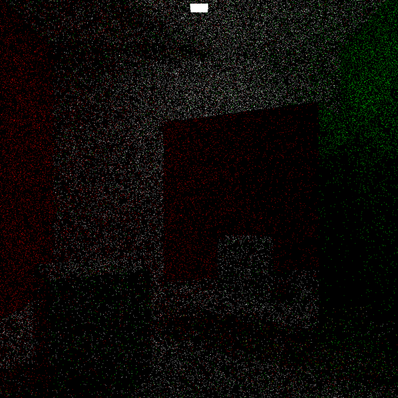

# CPU PBR Path Tracer
## Written in C++ from scratch by Daniel Qin (qindan@seas.upenn.edu)
*Development: mid August 2025 – early October 2025*
*Note that this project has been superseded by my CUDA path tracing project (https://github.com/DanielQ-51/cudapathtracer), which is much, much more in depth, with various advanced global illumination algorithms. This project's code also contains a few algorithmic mistakes.*

 
Welcome! This project was made with support from a collection of online sources, with the largest being the book Physically Based Rendering: From Theory to Implementation (PBRT), which taught me most of the theory behind path tracing and also served as the inspiration behind some of the inheritance structure behind my code's handling of Integrator, BSDF, and Sampler objects. All code is still mine though. 

 
 

This path tracer currently supports three main classes of materials: a diffuse lambertian material (cosine weighted), a mirror material, and a metal-like material (Phong). These can be seen in the images below:
 

 

  
  

 
One of the cooler things about this path tracer is that it uses Multiple Importance Sampling (MIS) to accurately combine BSDF sampling with direct light sampling (Next Event Estimation). Direct sampling of the lights allows the path tracer to accurately handle small light sources. With only BSDF sampling, which is where you hope that your bouncing rays happen to find a light source, small light sources are very hard to get right. Below is a comparison of only BSDF sampling versus MIS combining BSDF and light sampling. I hope you can tell which is which!
 

 

  
  

 
With our MIS, we are able to handle more complex lighting with multiple light sources of different sizes. For example, the following scene has a ton of different lights, including some behind the camera.
 

 

 
One other thing is that, as you may have noticed in the above image, there are a lot of interesting shapes in the scene. That's because this path tracer renders based on triangles, and is able to read in .obj files, convert all quads and n-gons to triangles, and render the resulting mesh. Another cool thing is that the colors of triangles are indeed interpolated between their vertices. The stellated tetrahedron in the center of the scene simply has a color assigned to each of its 8 points. Here's a clearer picture:

 
 

For any questions, please email or message me on linkedIn. I would be more than glad to answer any and all questions.

